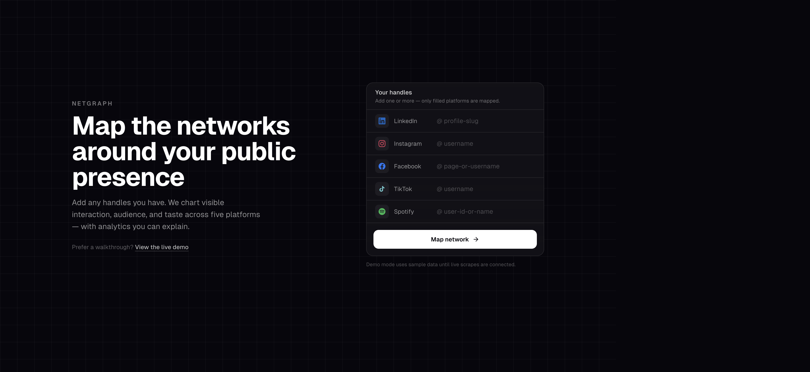
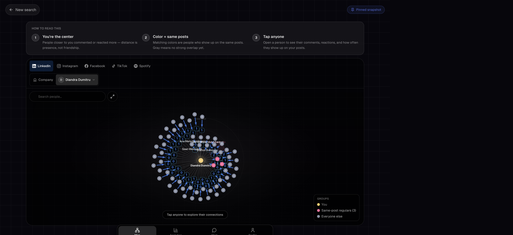

# Starling

Map the public networks around a LinkedIn, Instagram, Facebook, TikTok, or Spotify presence — as explainable graphs, not a black box.

**[Live demo](https://social-graph-nu.vercel.app/demo)** · [Getting started](docs/getting-started.md) · [Features](docs/features.md) · [Architecture](docs/architecture.md)



Add any handles you have. Starling charts visible interaction, audience, and taste. The committed demo at `/demo` runs entirely from frozen snapshots — no Apify credits required.



## Features

- **Multi-platform graphs** — LinkedIn, Instagram, Facebook, TikTok, and Spotify in one shell, with a Person / Company switch where it matters.
- **Proximity maps** — you at the center; distance is how often someone shows up, not a friendship score. Color groups people who land on the same posts.
- **Platform-native layouts** — TikTok videos → hashtags, Spotify playlists → genres, LinkedIn company hub-and-spoke plus a searchable roster.
- **Engagement receipts** — tap a node for comments, reactions, and how often they appear on your posts.
- **Analytics** — time-ranged KPIs, top engagers, company locations/schools/tenure, Spotify taste, TikTok plays.
- **Chat** — ask the graph questions (tables, charts, comparisons) with per-visitor quotas.
- **Shareable snapshots** — pin a scrape once and send `/demo` or `/graph/<handle>/pinned` instead of re-scraping.

Full tour: **[docs/features.md](docs/features.md)**

## Quick start

```bash
npm install
cp .env.example .env.local
npm run dev
```

Open [http://localhost:3000](http://localhost:3000). Without `APIFY_TOKEN` the app stays in demo mode:

| URL | What you get |
| --- | --- |
| `/` | Landing + handle form (sample data) |
| `/demo` | Multi-platform pinned bundle (Diandra + companions) |
| `/graph/wanderlust` | Deterministic mock Instagram graph |

Step-by-step env, scripts, and local pitfalls: **[docs/getting-started.md](docs/getting-started.md)**

## Documentation

| Doc | What’s in it |
| --- | --- |
| [Getting started](docs/getting-started.md) | Install, env vars, how to run, where to click |
| [Features](docs/features.md) | Product tour: Map, Analytics, Chat, Profile, platforms |
| [Architecture](docs/architecture.md) | Routes, UI components, `lib/` modules, data flow |
| [Snapshots](docs/snapshots.md) | Import pipelines, demo bundle, pinning to Blob |
| [Deploy on Vercel](docs/vercel.md) | Production env, KV, Blob, Chat quotas |

## Stack

Next.js 16 · React 19 · TypeScript · Tailwind · `react-force-graph-2d` · optional Vercel KV / Blob · TokenRouter for Chat
