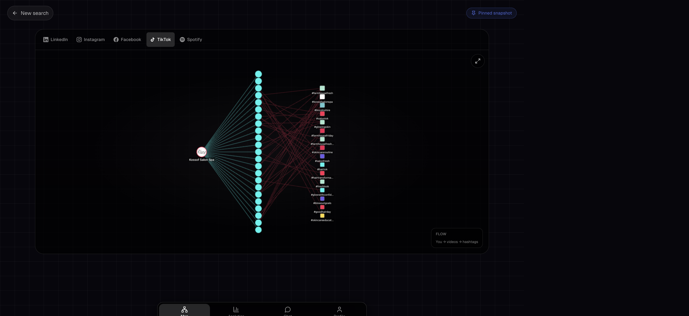

# Features

Back to the [README](../README.md).

The graph shell is one page with four footer tabs — **Map**, **Analytics**, **Chat**, **Profile** — plus platform tabs along the top.

## Map

Social platforms (LinkedIn person, Instagram, Facebook) share a force-directed people graph:

1. **You’re the center.** Closer nodes commented or reacted more — distance is presence, not friendship.
2. **Color = same posts.** Matching colors are people who show up on the same posts. Gray means no strong overlap yet.
3. **Tap anyone** for comments, reactions, and how often they appear.

Search the graph, go fullscreen, and (LinkedIn company) switch **Map** vs a searchable **Roster**.

LinkedIn and Instagram also have a **Person / Company** control. Company LinkedIn is a hub-and-spoke of employees; Instagram Company is the business account, with employee nodes you can open as their own person graph. Aiman Naqvi (`@nuancedaiman`) is a separate Instagram job, not part of the salon roster.

## Platform-native maps

Not every platform is a people graph. TikTok and Spotify keep their own shape:

| Platform | Map |
| --- | --- |
| **LinkedIn person** | You at the center, proximity rings, same-post clusters |
| **LinkedIn company** | Company hub → employees; roster table (name, title, location, tenure, school) |
| **Instagram company** | Salon/page graph + employee nodes that open a person graph |
| **Instagram person** | Employee comment/reel graphs. Aiman (`@nuancedaiman`) is his own Instagram job |
| **Facebook** | Page at the center; followers, following, and post engagers |
| **TikTok** | You → videos → hashtags |
| **Spotify** | You → playlists → genres ← a friend’s playlists |
| **Conference** | Event hub → companies → attendees (Luma guest list + LinkedIn matches) |

## Analytics

Same platform switcher as Map, plus a time range (day / week / month / all). Bodies change by platform:

- **Social** (LinkedIn, Instagram, Facebook) — KPI line chart, activity calendar, packed post bubbles, commentator bars, reaction donut
- **Company** — employee rank by reach, locations, schools, tenure timeline
- **TikTok** — plays, likes, shares, hashtag reach
- **Spotify** — tracks, artists, playlists, genre mix

## Chat

Ask questions against the loaded snapshots (not the open web). Suggested prompts cover comparisons, tables, and time series. The model can return markdown, tables, and charts. Voice in/out is optional.

Quotas apply in production (per visitor, per IP, global daily cap, cooldown). Requires `TOKENROUTER_API_KEY`. Without it the tab still renders and explains that Chat is unconfigured.

## Profile

Lists the public source accounts in the current bundle (LinkedIn person, company, Instagram, Facebook, TikTok, Spotify) with avatars and outbound links.

## Sharing

`/demo` is the canonical multi-platform walkthrough. Other frozen graphs live at `/graph/<handle>/pinned`. Production can store extra pins in Vercel Blob so they are not committed to git. See [snapshots.md](snapshots.md).
