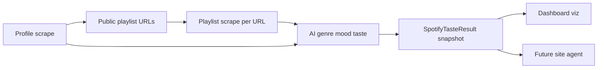
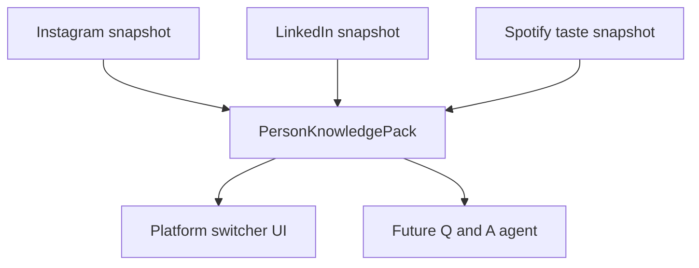

# Multi-platform Spotify + Agent-Ready Plan

Capture Spotify scrapes via an offline import pipeline (Apify-free for now), run AI inference for genres/moods/taste profiles, add a platform switcher (Instagram / LinkedIn / Spotify) with Spotify-native visualizations and gamified stats, and design the data model so a future site agent can query all platforms.

## What the raw scrapes give us today

### 1. Profile scraper — `data/spotify_raw/me_igor_diego_profiles.json`

Array of user profiles. Per profile:

- Identity: `user_id`, `display_name`, `profile_image`, `source_url`
- Social: `followers_count`, `following_count`
- Catalog: `total_public_playlists_count`, `playlists[]` with `title`, `url`, `image`, `created_at_proxy`
- `recently_played_artists` exists but is empty in these samples (treat as optional)

**Quirk:** `created_at_proxy` is unreliable — sometimes a date (`Jun 14, 2021`), sometimes a track/album string (`Declaratie De Dragoste (Vol. 5)`, `Bruno Mars`). Do not trust it as a real created-at.

**Signal already in titles:** Diego’s playlists are strongly genre-coded (`Jazz`, `Metal`, `Rap`, `Ethereal Minimalism`, `Western & Country`). Sebastian’s are mood/context-coded (`Workout`, `Chillz`, `Bangers`, `Car`). Titles are a strong AI prior before track enrichment.

### 2. Playlist scraper — `data/spotify_raw/me_shmok_playlist.json`

One playlist payload (Schmok, 37 tracks). Per track:

- `trackName`, `trackId`, `artists[{artistName, artistId}]`
- `plays`, `trackDuration`, `albumName` / `albumId` / `albumArt`
- `contentRating`, `addedAt`, `trackNumber`

**Missing (must infer):** genres, moods, tempo/energy/valence, or any audio features. No genre fields anywhere in either file.

### Pipeline shape (matches how you scraped)

---

## Locked product decisions

1. **Offline-first, Apify-free for now** — same pattern as LinkedIn (`lib/importLinkedInRaw.ts` → pinned snapshot). Import profile JSON + one or more playlist JSONs; do not wire live Apify until credits return.
2. **AI inference is required** for genres, moods, and taste labels — heuristics alone are not the product. Heuristics (playlist title keywords, artist frequency) feed the model as evidence, not the final truth.
3. **Agent-ready from day one** — normalize Instagram / LinkedIn / Spotify into a shared “person knowledge” shape so a future on-site agent can ask questions across all of it.
4. **Spotify is not a people force-graph** — reuse the dashboard shell (platform switch, stats rail, share) but ship Spotify-native views (artist graph, taste radar, mood map, playlist timeline).

---

## Data model (new)

Add Spotify-specific types alongside existing `lib/types.ts` social-graph types. Do not force Spotify into `Commentator` / `GraphNode`.

Proposed core types:

- `SpotifyProfile` — identity + follower counts + playlist index
- `SpotifyPlaylistSummary` — title, url, image, trackCount (when known)
- `SpotifyTrack` — raw track fields from scrape
- `SpotifyTasteProfile` — AI output: top genres, mood scores, era bias, explicitness, diversity, “main character” artists
- `SpotifyInference` — structured labels with confidence + evidence (playlist titles, track lists, artist repeats) so the agent and UI can cite receipts
- `PlatformBundle` — `{ platform, profile, socialGraph?, taste?, scrapedAt }` wrapper so Instagram/LinkedIn/Spotify snapshots share one envelope for the future agent

Mirror LinkedIn import:

- `lib/importSpotifyRaw.ts` — detect + parse profile/playlist dumps
- Script (like `scripts/import-raw-snapshot.ts`) — merge profile + playlist files → AI enrich → write `data/snapshots/{handle}-spotify.json` (or nest under a multi-platform snapshot)

---

## AI inference layer

**Input:** profile playlist titles + N detailed playlists (tracks/artists/plays/`addedAt`).

**Output (structured JSON):**

- Genre mix (weighted %): e.g. alt-R&B, pop, hip-hop, rock
- Mood axes (0–100): energy, melancholy, party, focus, nostalgia, romance, gym, chill
- Taste stats: unique artists, repeat-artist concentration, collab density, avg track popularity (`plays`), explicit %, listening-era from `addedAt` + song/artist cues
- Gamified archetypes: short labels with reasons (“Late-Night Melancholy Curator”, “Playlist Maximalist”) — same spirit as existing relationship labels in `lib/labels.ts`
- Evidence array per claim for UI tooltips and the future agent

**Constraints:**

- Run offline at import/snapshot time first (deterministic cached result on pinned pages). Live on-demand inference can come later.
- Keep Instagram/LinkedIn labeling patterns: confidence, evidence, editable later if needed.
- No live Apify; AI call only for enrichment of already-imported JSON.

---

## Dashboard UX

### Platform switcher

On the graph/dashboard shell (`components/GraphResult.tsx`):

- Tabs: **Instagram | LinkedIn | Spotify**
- Same person/handle context where possible; each platform loads its own snapshot/result
- Instagram keeps Map/Grid; LinkedIn keeps Map/Grid; Spotify gets its own view modes

### Spotify view modes (multi-form viz)

1. **Taste overview** — big numbers + genre bars + mood radar (default)
2. **Artist constellation** — force graph of artists (node size = track count / prominence; edges = co-occurrence on tracks) — reuses `react-force-graph-2d` muscle, different semantics
3. **Playlist shelf** — cards from profile scrape; click loads that playlist’s track breakdown when imported
4. **Timeline** — tracks/`addedAt` over years (Schmok already spans 2019–2021)

### Gamification (numbers people share)

Examples grounded in real fields + AI:

- Taste Diversity Score, Main-Character Artists (top by frequency), Mood Signature, Explicit Ratio, Era Bias, Playlist Personality badge
- Share card variant (extend `components/ShareCard.tsx`) with Spotify stats instead of “clusters / connections”

### Seed demo

Use Sebastian’s profile + Schmok playlist as the first pinned Spotify demo (you already have both sides of the pipeline). Optionally also index Diego/Igor playlist titles for a “playlist-title-only” taste preview when track scrapes are missing.

---

## Future site agent (design now, build later)

Goal: an on-site agent that can ask questions using **all** platform data for a person.

Plan ahead without building the chat UI yet:

- Persist a `PersonKnowledgePack` per handle: Instagram graph summary + LinkedIn engagers + Spotify taste/inference + raw evidence pointers
- Agent tools later: `getTasteProfile`, `listTopArtists`, `comparePlatforms`, `explainMood`, `getSocialClusters`
- Inference receipts (genre/mood evidence) are what make agent answers trustworthy
- Pinned snapshots remain the Apify-free source of truth for demos

---

## Phased delivery

### Phase 0 — Capture + import

- Document scrape field map (done above)
- `importSpotifyRaw` + merge profile + playlist JSON
- Snapshot writer for Spotify
- No live scrapers

### Phase 1 — AI taste pass

- Structured genre/mood/archetype inference over imported playlists
- Cache inference on the snapshot (pinned pages stay static)

### Phase 2 — Spotify dashboard surfaces

- Platform switcher in dashboard shell
- Taste overview + artist constellation + gamified stats + share card

### Phase 3 — Multi-playlist depth

- Import multiple playlist detail files per user
- Cross-playlist artist graph + mood by playlist

### Phase 4 — Agent

- Knowledge pack assembly across platforms
- On-site Q&A over pinned/demo data first

---

## Implementation checklist

- [ ] Add `importSpotifyRaw` + script to merge profile + playlist JSON into a Spotify snapshot (Apify-free)
- [ ] Define SpotifyProfile / track / taste / inference types and PlatformBundle envelope for agent-readiness
- [ ] Add AI inference pass: genres, mood axes, archetypes, evidence — stored on snapshot
- [x] Add Instagram | LinkedIn | Spotify switcher to dashboard shell (UI shell; empty states until snapshots exist)
- [ ] Ship Spotify views: taste overview, artist constellation, playlist shelf, gamified numbers + share card
- [ ] Pin Sebastian + Schmok as first Spotify demo snapshot
- [ ] Later: PersonKnowledgePack across platforms + site agent tools/Q&A

---

## Out of scope for early phases

- Live Apify Spotify actors (until credits)
- Trusting `created_at_proxy` as dates
- Relying on `recently_played_artists` until samples show real data
- Forcing Spotify into the existing people `ScrapeResult` graph schema
